# 报告标题
## 目录
- 0.摘要
- 1.背景
- 2.分析过程
 - 2.1 三种思路
 - 2.2 具体步骤
- 3.结论
- 4.讨论
- 5.参考文献

## 0. 摘要
开智学堂「信息分析」第三期第1周进阶作业1的完全版报告。内容包括背景、分析过程、结论、讨论以及参考文献。
## 1. 背景
请阅读下面的文字，检索出从 A~F 的答案，完成一份信息分析报告，字数 500 字左右，请在 2wd1 08:42 前提交在下面的文本框里。
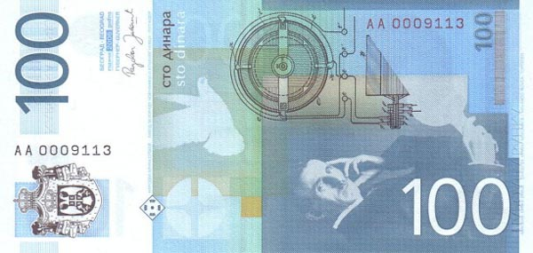
> 这是 A 国 2006 年发行的纸币，用来纪念 20 世纪物理学家、发明家 B 。他精通多个领域，一生拥有上千项专利，最著名的发明是 C 。

> 为了纪念他，在美国纽约 D 瀑布 E 方向伫立着 B 的铜像，这座铜像具体地址是 F 。他拄着拐杖平静地凝望远方，夜幕降临，七彩霓虹随瀑布倾泻而下。
## 2. 分析过程
## 2.1 三种思路
### 思路一：

常规思路。在谷歌图片中搜图，可以获得一些重要信息,例如：使用货币的国家，顺着可以搜出这个国家纸币上的人物。

### 思路二：

## 2.2 具体步骤
### 过程一：
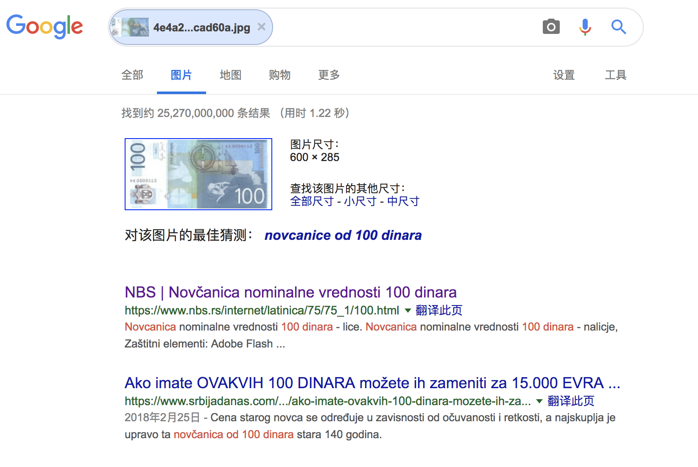
可以看到使用货币的国家为：塞尔维亚
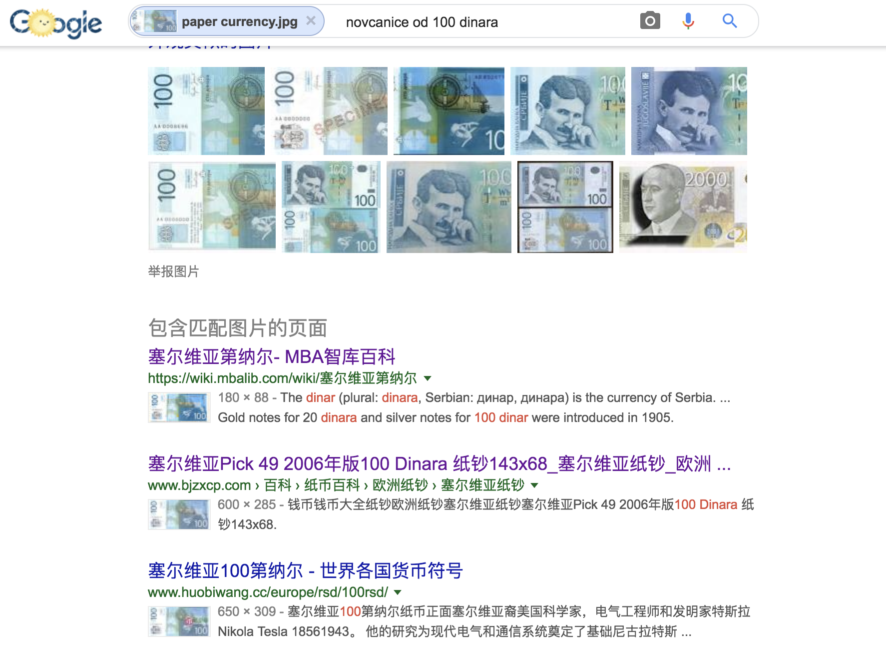
进入[塞尔维亚第纳尔
-MBA智库百科](https://wiki.mbalib.com/wiki/%E5%A1%9E%E5%B0%94%E7%BB%B4%E4%BA%9A%E7%AC%AC%E7%BA%B3%E5%B0%94)，看到这张纸币为：100第纳尔；纸币上的人物是： Nikola Tesla
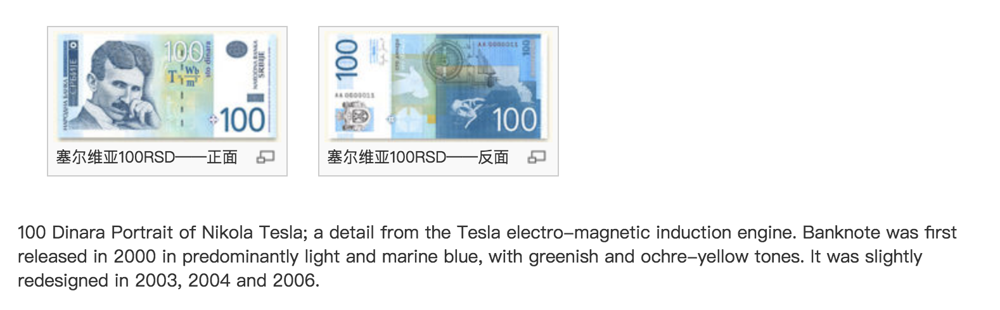

交叉验证人物是否正确，进入维基百科搜索[Serbian dinar](https://en.wikipedia.org/wiki/Serbian_dinar#Banknotes)，可见：
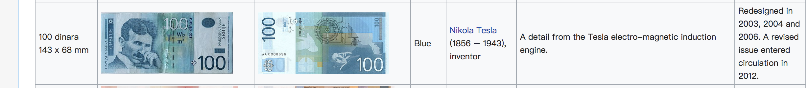

说明上面的人物确实为：Nikola Tesla，是一位发明家。继续在维基百科搜索[Nikola Tesla维基百科](https://en.wikipedia.org/wiki/Serbian_dinar#Banknotes)。他是塞尔维亚裔美国人，发明家，电气工程师，机械工程师和未来学家，闻名于世的贡献为：设计现代交流电供电系统。
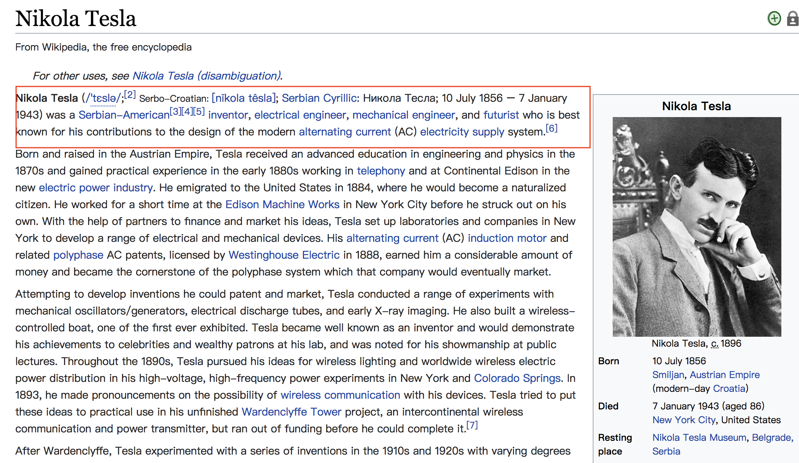

在[Nikola Tesla维基百科](https://en.wikipedia.org/wiki/Serbian_dinar#Banknotes)页面，同样可以发现纪念他的**牌匾和纪念碑**的信息。仔细阅读，发现其中有一条和题目有关，红框里的部分显示地点在**纽约**。

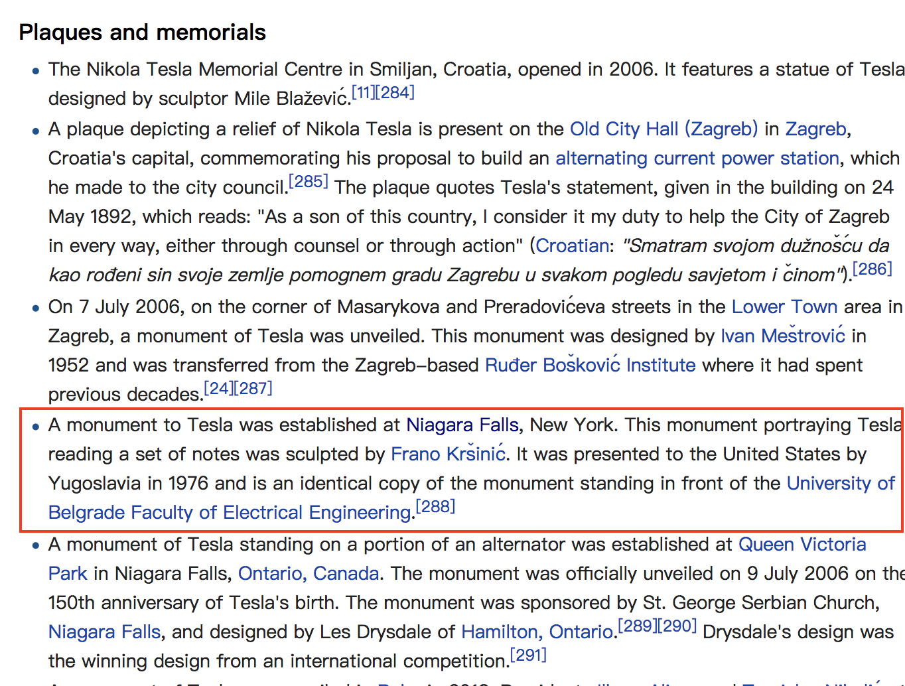

翻译原文：
> 纽约尼亚加拉瀑布城修建了一座特斯拉雕像。 这座雕像是由弗朗索瓦 · 克里尼雕刻而成，展现特斯拉正在阅读一组笔记。南斯拉夫于1976年将这座雕像赠送给美国，与贝尔格莱德大学电机工程学院门前的纪念碑一模一样。

可是问题来了，题目中说的是杵着拐杖，**阅读笔记** 和 **杵着拐杖** 似乎矛盾。

接着查看地址：
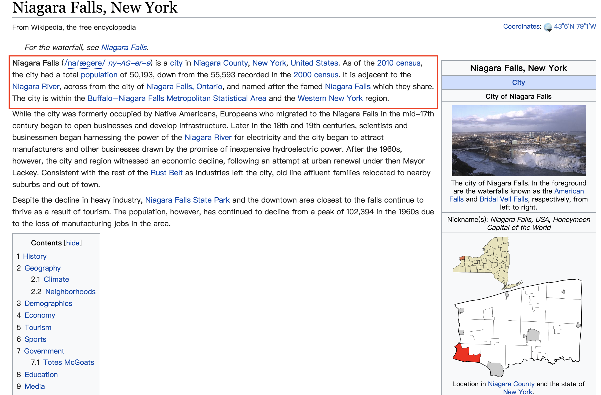
> 尼亚加拉大瀑布城是美国纽约州尼亚加拉县的一座城市。截至2010年人口普查，该市总人口为50193人，低于2000年人口普查记录的55593人。该市毗邻尼亚加拉河，与安大略省的尼亚加拉大瀑布市隔河相望，并以它们共享的著名尼亚加拉大瀑布命名。这座城市位于布法罗-尼亚加拉大瀑布大都会统计区和纽约西部地区。

原来瀑布城的对面是加拿大安大略省的尼亚加拉大瀑布。
在谷歌地图中搜索Nikola Tesla，出现了的结果：
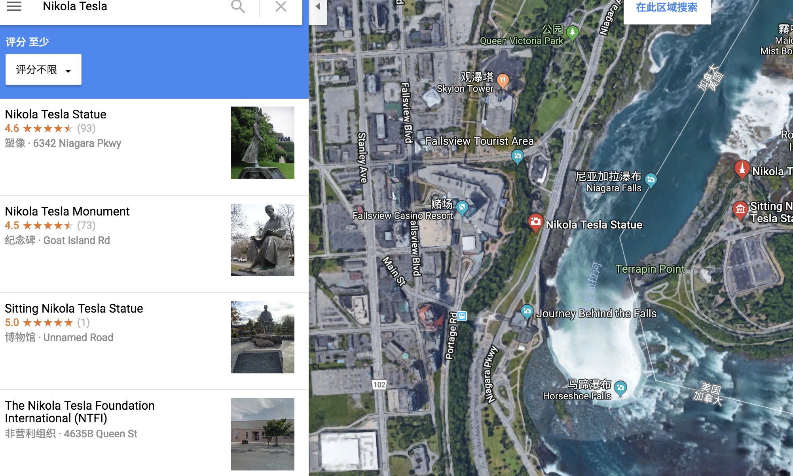
关于雕像出现3个结果，两个在美国纽约州的尼亚加拉瀑布城，一个在加拿大的安大略省。

继续在谷歌中搜索，进行交叉验证。搜索 Nikola Tesla, 发现[ Tesla Memorial Society](http://www.teslasociety.com/niagarafalls_tesla.htm),在里面发现了跟特斯拉有关的几个雕像的信息：

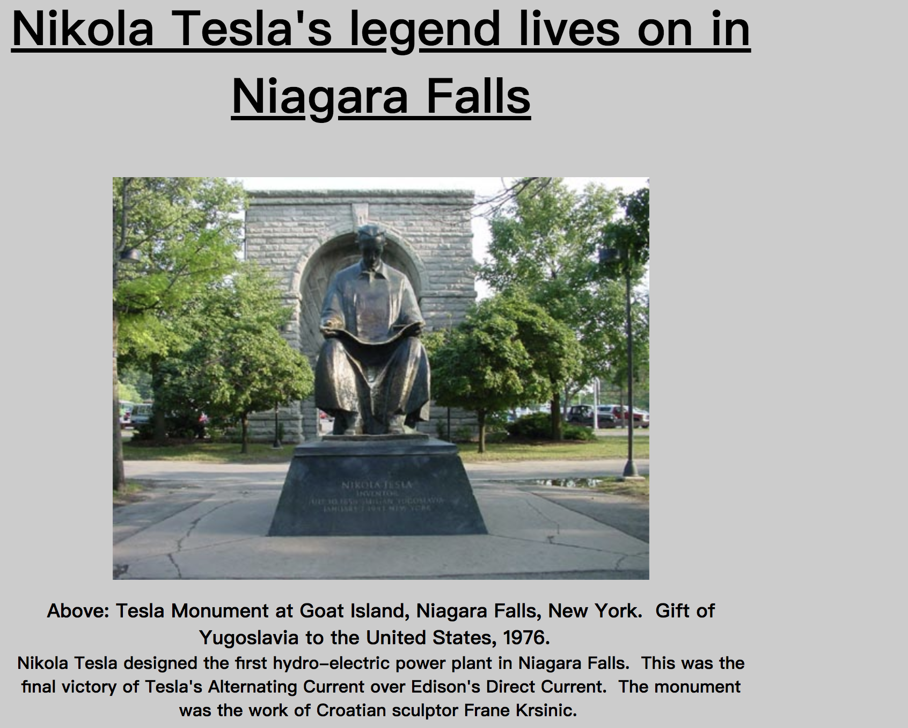

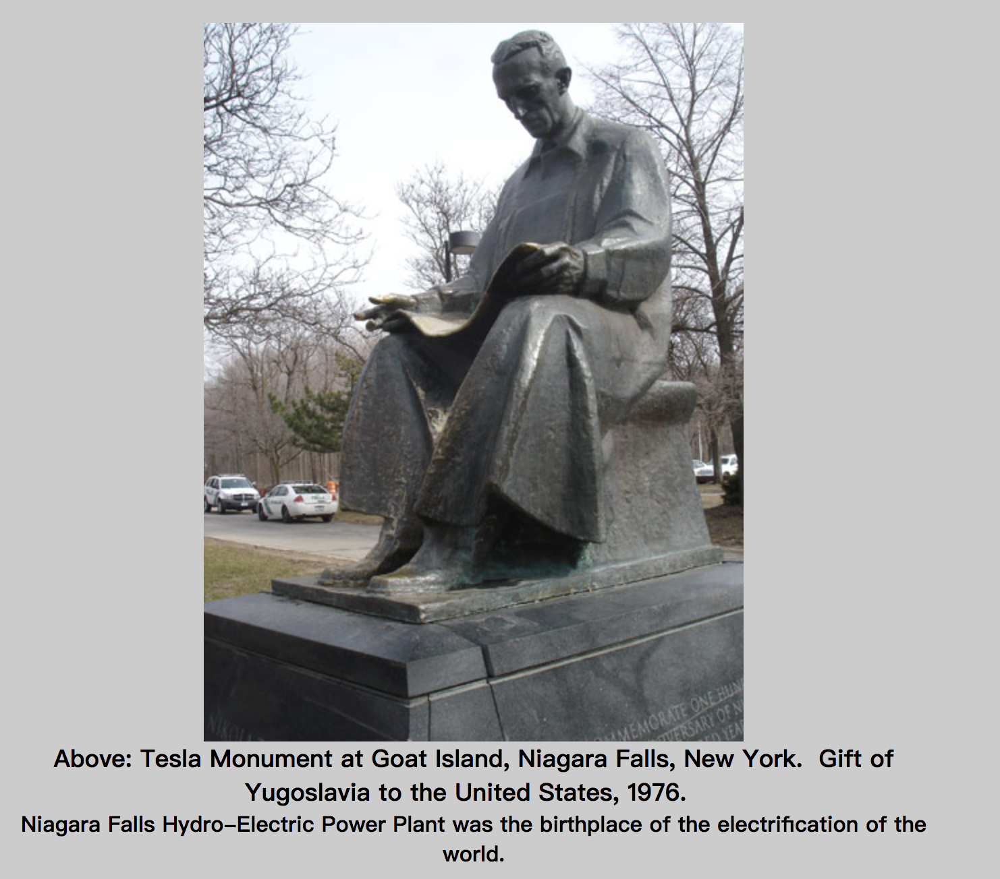

与之前的维基百科相呼应，说明在美国纽约尼亚加拉瀑布城的特斯拉雕像的确是坐着阅读笔记的。

>  纽约尼亚加拉瀑布城修建了一座特斯拉雕像。这座雕像是由弗朗索瓦 · 克里尼雕刻而成，展现特斯拉正在阅读一组笔记。南斯拉夫于1976年将这座雕像赠送给美国，与贝尔格莱德大学电机工程学院门前的纪念碑一模一样。

继续搜索[ Tesla Memorial Society](http://www.teslasociety.com/niagarafalls_tesla.htm)，找到一张杵着拐杖的特斯拉雕像：

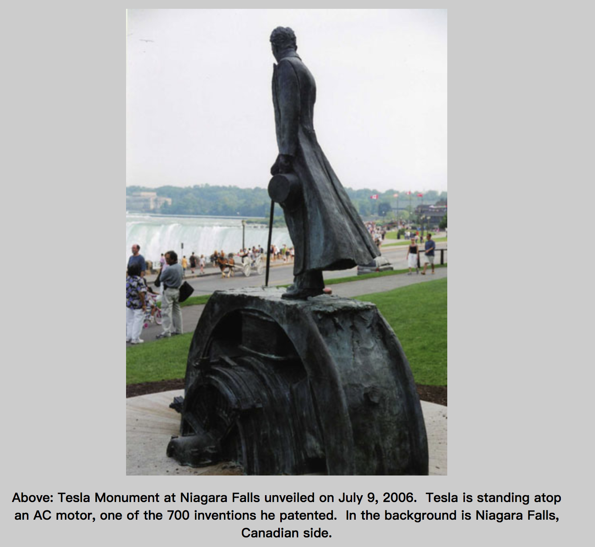
图片下方文字注明：位置是加拿大一侧，尼亚加拉大瀑布。

继续交叉验证，进入在[Nikola Tesla维基百科](https://en.wikipedia.org/wiki/Serbian_dinar#Banknotes)，在文中搜到这样的图片：

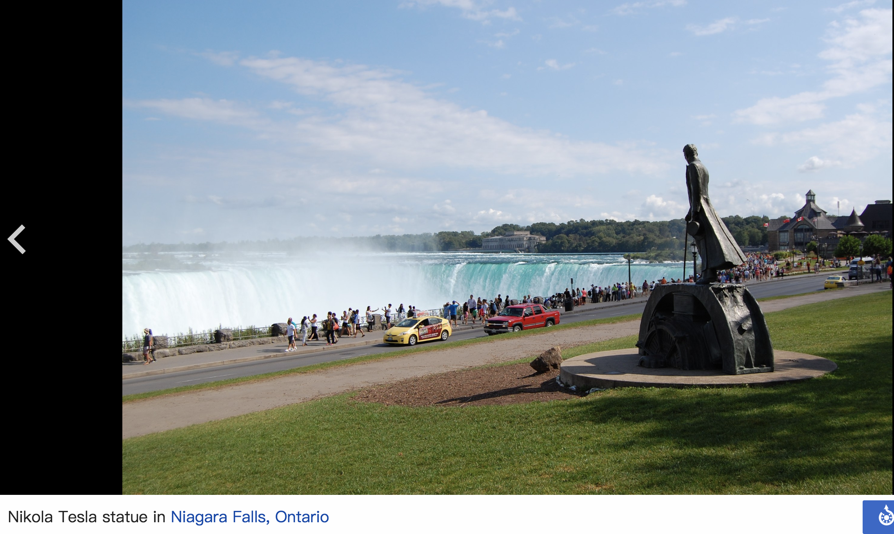

文中地址标注：加拿大安大略省。
这张图与题目描述一致：
> 他拄着拐杖平静地凝望远方，夜幕降临，七彩霓虹随瀑布倾泻而下。

再返回谷歌地图搜索Nikola Tesla，可得图片：
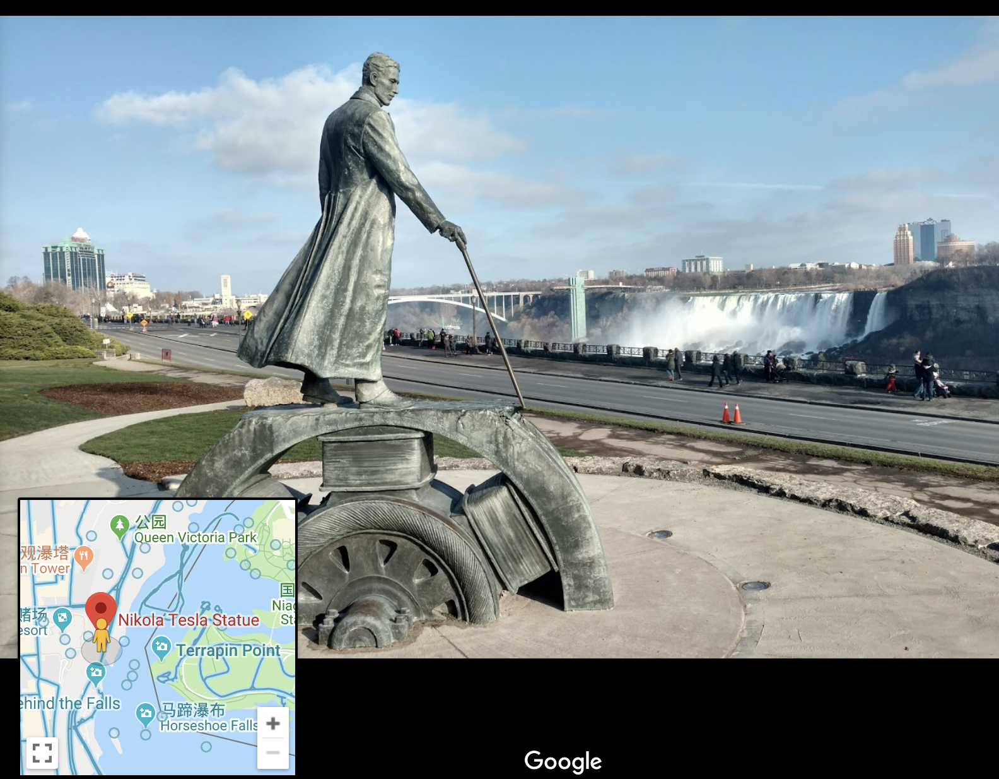

这座雕像在美国纽约尼亚加拉瀑布的对岸加拿大安大略省。而美国纽约瀑布城的雕像为特斯拉坐着阅读笔记。

出战拐杖的特斯拉雕像地址为：**加拿大安大略省尼亚加拉瀑布城尼亚加拉公园大道维多利亚女王公园**。

谷歌地图显示地址为：**6342 Niagara Pkwy, Niagara Falls, ON, 加拿大**.

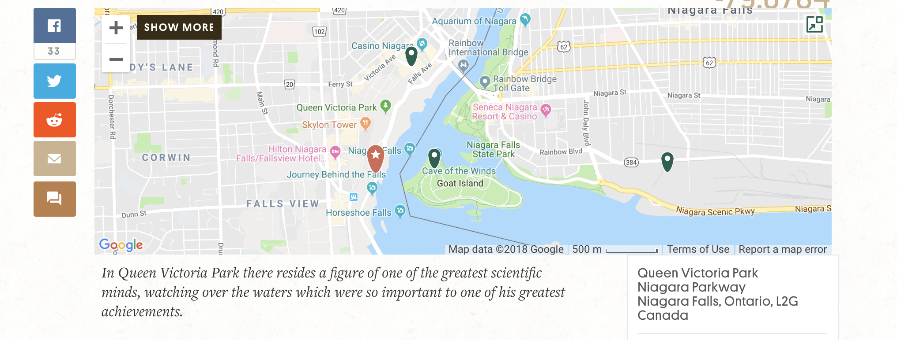

谷歌地图中可以看到位置，粉红色圈出的位置就是题目中提到的Nikola Tesla杵着拐杖望着大瀑布的雕像，位于美国纽约尼亚加拉瀑布城的西南方向。

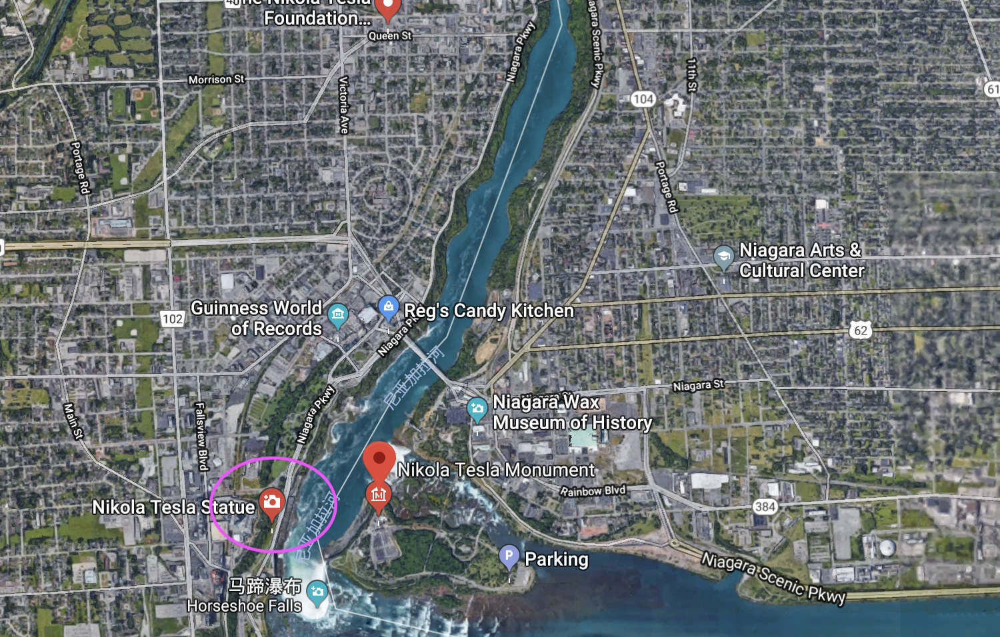

最后放一张3D的特斯拉和他凝望的瀑布图：

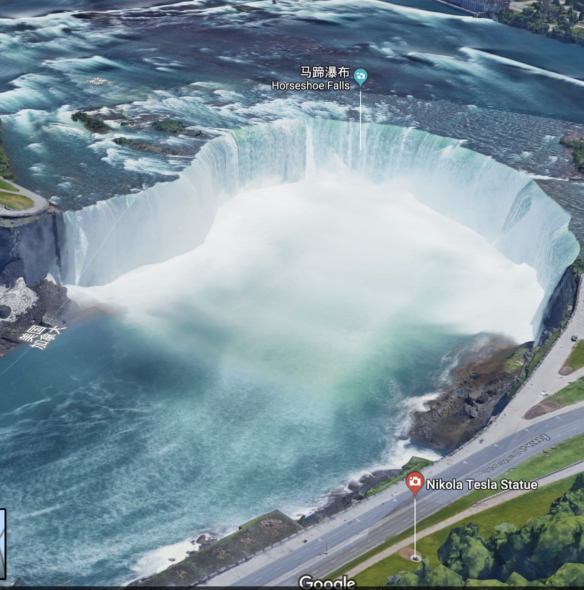

很美！

### 过程二：
待补充

## 3. 结论
这是塞尔维亚国 2006 年发行的纸币，用来纪念 20 世纪物理学家、发明家 尼古拉·特斯拉(Nikola Tesla)。他精通多个领域，一生拥有上千项专利，最著名的发明是现代交流电供电系统。

为了纪念他，在美国纽约尼亚加拉瀑布西南方向伫立着尼古拉·特斯拉(Nikola Tesla)的铜像，这座铜像具体地址是6342 Niagara Pkwy, Niagara Falls, ON, 加拿大。他拄着拐杖平静地凝望远方，夜幕降临，七彩霓虹随瀑布倾泻而下。
## 4. 讨论
### 4.1 对结论的讨论
- 待补充
### 4.2 可优化的环节
- 过程一比较绕，可以精简步骤；比如：搜到图片后就进行验证，然后进行下一个问题的探索。我在几个地方进行了非常反复的搜索和验证，甚至有时候被搜索带跑，搜索了一些和主题没有关系的内容。
- 优化对图床的使用：寻找方便的插件。

### 4.3 收获：建立工具思维
- 过程一比较详细，但是花费的时间久，目标是：熟悉编辑器、添加图片的过程；培养认真写作业的习惯；更重要的是，培养交叉验证和快速搜索信息的能力和习惯的养成。这道题目毫无疑问有更加简单和快速的方法，用常规方式走完一遍，就是希望自己能够把基础打牢。
- 关于习惯。刚开始写作业想使用dropzone和七牛云的结合，但是配置了之后依然无法成功使用，甚至在这个过程折腾了几个小时，浪费了很多时间，但后来明确目标，先完成作业为主，于是采取了其他办法，如：新浪图床。这里发现了自己一个不好的习惯：没解决的问题必须解决了才可以进行下一步，对优先级不予区分，很多时候会耽误很多时间精力。这个过程收获的习惯是：遇到困难，如果不是影响到目标无法继续，先集中精力完成主要任务，而不是被困难带跑。难题可以先记下，完成任务后研究或者请教别人。
- 把问题推向无穷

## 5. 参考文献
- https://www.history.com/topics/inventions/nikola-tesla
- https://en.wikipedia.org/wiki/Nikola_Tesla
-
https://en.wikipedia.org/wiki/List_of_things_named_after_Nikola_Tesla#Places

## changelog
- 181213 撰写思路一和过程一
- 181214 补充图片，编写结论
