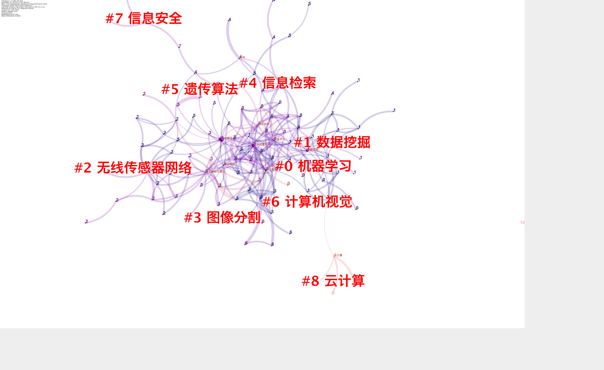
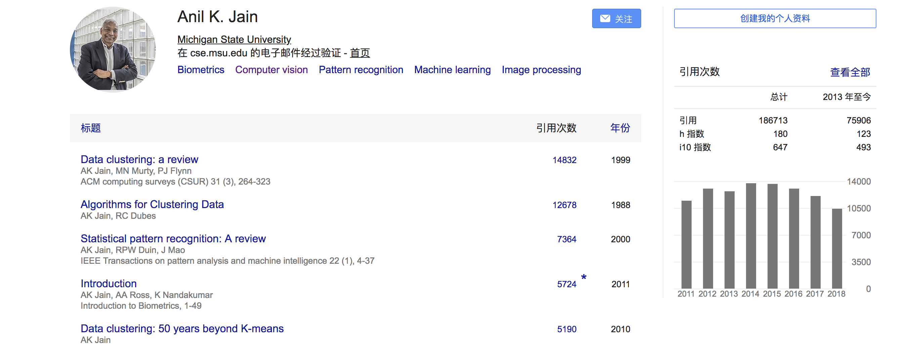

# 信息分析三期2周进阶作业1：计算机科学的最小全局认识
## 目录
- 0.摘要
- 1.背景
- 2.时间分析
- 3.空间分析
- 4.变量关系
- 5.结论
- 6.讨论
- 7.参考文献

## 0. 摘要
作为一个刚刚敲完《笨办法学Python》的编程小白，对编程有了最初步的认识和实践。但是对于计算机科学这门学科的知识还知之甚少，计算机基础也非常有限，所以借助课程中的学术信息全局认识技巧，对计算机科学这个学科进行最小全局认识。最小全局认识将从**时间**、**空间**和**变量关系** 得出结论。

- 时间：
  - 找到领域发展的时间脉络，重要时间节点
  - 文章数量随时间的分布关系
- 空间：
  - 核心期刊
  - 核心研究机构
- 变量关系：
  - 大牛
  - 模因，可以看做是关键的一级术语和二级术语

## 1. 背景
信息分析W2进阶作业1要求：
> 运用至少两种实践策略，形成对「心理学」或自己感兴趣领域的全局认识，记录探索过程，完成一份信息分析报告。

> 注意：使用的实践策略中须包含「批量下载 1000 篇论文」。
## 2. 时间分析

首先在[开智信息分析工具箱
](https://github.com/JIANG09/IAToolkit?organization=JIANG09&organization=JIANG09)搜索「计算机」，得到一个有用的[sindresorhus/awesome list
](https://github.com/sindresorhus/awesome#computer-science),搜索computer science，得到：

计算机科学大约有这几个主要领域，包括数据科学、机器学习、自然语言处理、密码学、计算机视觉、信息检索等。

### 2.1 宏观搜索
首先用[Google Books	Ngram Viewer](https://books.google.com/ngrams/graph?content=computer+science&year_start=1950&year_end=2008&corpus=15&smoothing=3&share=&direct_url=t1%3B%2Ccomputer%20science%3B%2Cc0)中搜索computer science，得到：

选择了英语的语料库，可见计算机科学的书籍从1950-60年代左右开始慢慢兴起，到了1985-1990期间达到一个高峰，是否学术研究也是和图书同步呢？没有得到交叉验证的情况下先做一个猜测。

### 2.2 下载论文导入zotero
从CNKI下载1000篇计算机科学领域的博士论文，并导入zotero。在CNKI中搜索‘计算机科学’，并选择博士论文，按照被引用频次从高到低排序，最后选择下载了1000篇论文摘要，并导入zotero。

因为和万方数据库下载的条目和CNKI有几个重复的，所以删除了重复的部分。按照年份排序，可以看到论文大约是从1992-2017年。

### 2.3 运用citespace生成关键词图谱

拿到将近1000篇论文，第一个感觉是毫无头绪，不知道从何读起。于是，将数据集导入citespace，进行关键词分析，看看哪些关键词是领域内比较重要和研究比较多的。

调整citespace，从文献的标题中提取聚类命名术语。可以看到机器学习、人工神经网络、关联规则、云计算、本体等是这个数据集中比较重要的术语，这个结果是否正确还需要交叉验证后的结果。

可以看到遗传算法是一个比较大的结点。

这是05-18年的cluster关键词分析:

可见，近十年计算机领域的关键词或是研究领域发生了一些变化：
- 聚类分析、关联规则、专家系统不再出现；
- 机器学习、数据挖掘、计算机视觉、云计算依然是领域研究比较关注的方面；
- 另外信息安全也一直都是关注重点。

### 2.4 在Acemap中进行交叉验证
Acemap是一个主要关于计算机科学的在线知识图谱，所以用Acemap来进行交叉验证会比较有优势。在主页搜索computer science：

可以看到子话题有：算法、人工智能、数据挖掘、人机交互、机器学习、自然语言处理等。

但是这些子话题均是整齐的排列出来，并看不出权重，也看不出近几年研究的重点和变化。

### Acemap中的关键词分布和时间线

Acemap上显示论文发布的最多的几个年份是2010， 2013，2015，在2010-2015年检的发布数量都非常多，说明这五年是计算机科学的发展比较快的年份。

## 3.空间分析
### SJR寻找主要期刊
SJR搜索到的排名前3的期刊：

[Journal of Statistical Software](https://www.jstatsoft.org/index), 这本期刊主要关注软件领域和一些编程语言，在SJR上排名第一，并且期刊文献的领用量逐年上升，在2017年达到了以往年度的最高。有open access的官网，有关于很多编程语言的论文，可以供参考

[Molecular Systems Biology
](http://msb.embopress.org/)

[Bioinformatics
](https://academic.oup.com/bioinformatics)这两本是计算机科学在生物学领域的运用，目前来看不是特别符合我要寻找的顶级期刊。

### Acemap核心期刊和顶级会议

和SJR排名的期刊没有重叠的。可能原因：计算机科学是个上位词，包含的子学科众多，期刊分布也很广，所以有偏差。

### google学术
[Google学术metrics](https://scholar.google.com/citations?view_op=top_venues&hl=en&vq=eng)上面只有细分领域的期刊排名，选择数据挖掘：

### 搜索过程中发现的期刊
[The Computer Journal	](https://academic.oup.com/comjnl)是[Oxford Acedemic](https://academic.oup.com/journals)旗下期刊，5年的影响因子为0.86。

## 4.变量关系

### 4.1 Acemap和谷歌学术交叉验证顶尖学者
在Acemap中搜到的作顶级作者在谷歌学术中进行交叉验证，发现两个地方显示的作者H指数不一样，以哪一个为准暂时存疑。

通过[CS作者地图册](https://acemap.info/csAuthor)寻找到计算机科学领域内各个细分领域的作者，并通过谷歌学术找到他们的个人页面，列出一下几位在计算机科学比较重要的几个细分领域内的被引量最高的作者：

- [Trevor Hastie
](https://scholar.google.com/citations?user=tQVe-fAAAAAJ&hl=zh-CN)

这位作者在谷歌学术中的被引量排第一，但在Acemap中搜到个人页面，发现他大部分论文都不是第一作者。细分领域：数据挖掘，机器学习

- [Takeo Kanade](https://scholar.google.com/citations?user=LQ87h3sAAAAJ&hl=zh-CN),细分领域：计算机视觉
- [Anil K. Jain
](https://scholar.google.com/citations?user=g-_ZXGsAAAAJ&hl=zh-CN),细分领域：机器学习，计算机视觉，图像处理

### eyePlorer + Google学术

通过eyePlorer发现的Persons:

里面的权重比较大的大牛都在谷歌学术中进行了交叉验证，发现在谷歌学术中并不是排名很靠前，H指数也没有很高。

## 5. 结论
pass

## 6. 讨论
### 遇到的障碍
- zotero中的论文缺少被引用次数
- WOS等可以在citespace中运行的数据库没有权限进入，目前只能进入万方、CNKI以及一部分中文期刊。

### 思考
1. 首先是自己选择的领域比较宽泛，算是一个上位词，涉及的面很广，领域内的子话题非常多，导致在搜索大牛和研究机构的时候比较分散，抓取到的信息也比较分散，如果选取类似‘人工智能’，或者自然语言处理这样的细分领域，分析起来能够更有针对性，运用时空变量框架分析时也会更能得出准确和针对性信息。
2. 由于领域范围太广，找到的几位大牛是子领域内有名的大牛，但是排名目前不确定。
3. 目前最大的问题是，搜索到的信息成碎片化，没有形成有体系的信息块和清晰的时间脉络。这和搜索的领域太有关系，还有因为是自己的信息分析能力还在初阶，组织大量信息的能力比较弱，在海量的信息源中容易迷失重点，时空变量关系和搜索工具都才上手。总之，需要提升的很多啦。
4. 当陷入信息的汪洋大海中，要时刻提醒自己回到源头，源头就是20%的大牛贡献了80%的学术成果，包括:顶级大牛，顶级期刊，顶级研究机构和顶级博士论文。
5. 全局信息要的是快，尽可能多的增加信息量。可是自己在做这份作业的时候感到磕磕绊绊，还没有找到十分系统的输出方法。

## changelog
- 181220 创建并完成2.2.3；提出遇到的部分障碍。
- 181221 迭代，并将框架改为时刻变量关系。
